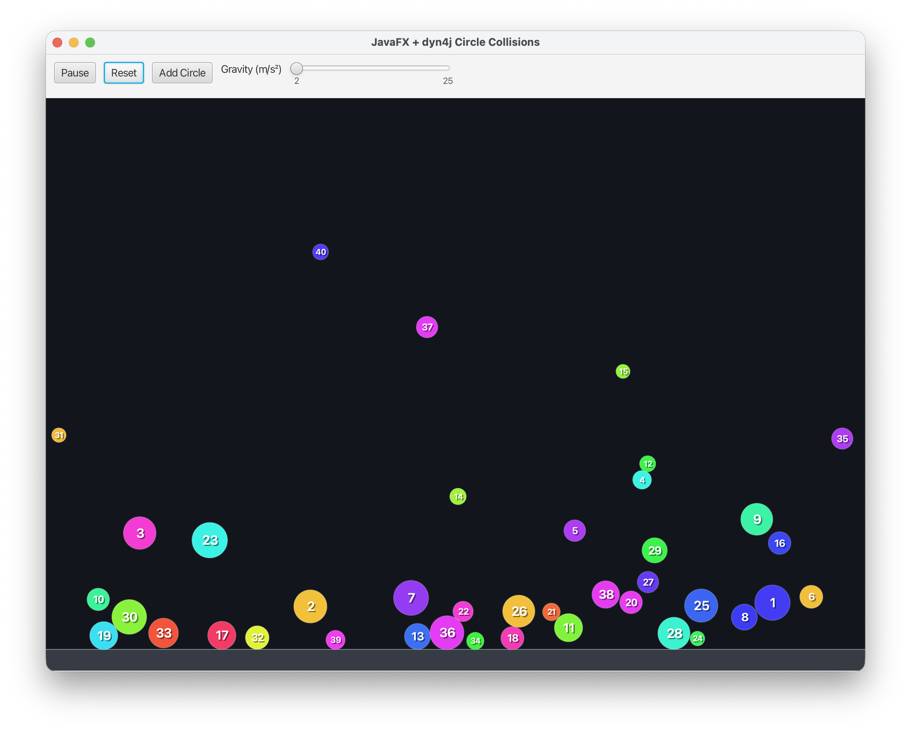
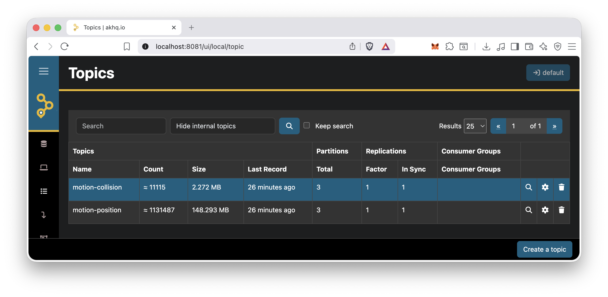

# motion-event-producer


### JavaFX + dyn4j simulation that now emits runtime events for future streaming integration.

## Quick start: choose a transport mode

This project supports 3 runtime modes:

1. **Direct Kafka mode** (`APP_TRANSPORT_MODE=kafka`)  
   The simulation app publishes directly to Kafka topics.
2. **WebSocket gateway mode** (`APP_TRANSPORT_MODE=websocket`)  
   The simulation app sends events to a WebSocket service, and that service publishes to Kafka.
3. **Logs-only mode** (`APP_TRANSPORT_MODE=logs`)  
   Events are printed to stdout (no Kafka required).

## Full Article:
### ⭐ [How I Built a Java Physics Simulation That Publishes Real-Time Kafka Events](https://medium.com/itnext/how-i-built-a-java-physics-simulation-that-publishes-real-time-kafka-events-2ec3f9d71156)
_A practical guide to producing motion and collision events from a Java physics simulation into Kafka._

## Running locally

AKHQ is a lightweight web UI for Kafka. You can use it to inspect topics, browse messages, check partitions/offsets, and monitor consumer groups while the simulation is running.

### Prerequisites

- Docker running locally
- Java 17
- Maven 3.9+
- Ports available: `9092` (Kafka), `8081` (AKHQ), and `8080` (gateway, if using websocket mode)

### Get the project

```bash
git clone git@github.com:wagnerjfr/motion-event-producer.git
cd motion-event-producer
```

### Build

```bash
mvn -DskipTests compile
```

---

## Mode A: Direct Kafka mode

Use this mode when the producer app can connect directly to Kafka.

Set:

```bash
APP_TRANSPORT_MODE=kafka
```

### A1) Start Kafka + AKHQ

#### 1) Create a Docker network (once)

```bash
docker network create kafka-net
```

#### 2) Start Kafka (dual listeners)

```bash
docker run -d --name kafka --network kafka-net -p 9092:9092 \
  -e KAFKA_NODE_ID=1 \
  -e KAFKA_PROCESS_ROLES=broker,controller \
  -e KAFKA_LISTENERS=PLAINTEXT_HOST://:9092,PLAINTEXT_DOCKER://:29092,CONTROLLER://:9093 \
  -e KAFKA_ADVERTISED_LISTENERS=PLAINTEXT_HOST://localhost:9092,PLAINTEXT_DOCKER://kafka:29092 \
  -e KAFKA_INTER_BROKER_LISTENER_NAME=PLAINTEXT_DOCKER \
  -e KAFKA_CONTROLLER_LISTENER_NAMES=CONTROLLER \
  -e KAFKA_LISTENER_SECURITY_PROTOCOL_MAP=CONTROLLER:PLAINTEXT,PLAINTEXT_HOST:PLAINTEXT,PLAINTEXT_DOCKER:PLAINTEXT \
  -e KAFKA_CONTROLLER_QUORUM_VOTERS=1@kafka:9093 \
  -e KAFKA_OFFSETS_TOPIC_REPLICATION_FACTOR=1 \
  -e KAFKA_TRANSACTION_STATE_LOG_REPLICATION_FACTOR=1 \
  -e KAFKA_TRANSACTION_STATE_LOG_MIN_ISR=1 \
  -e KAFKA_GROUP_INITIAL_REBALANCE_DELAY_MS=0 \
  apache/kafka:3.8.0
```

#### 3) Start AKHQ

```bash
docker run -d --name akhq --network kafka-net -p 8081:8080 \
  -e AKHQ_CONFIGURATION='akhq:
  connections:
    local:
      properties:
        bootstrap.servers: "kafka:29092"' \
  tchiotludo/akhq
```

Open AKHQ at:

- `http://localhost:8081`

#### 4) Create topics

```bash
docker exec -it kafka /opt/kafka/bin/kafka-topics.sh --create --topic motion-position --bootstrap-server localhost:9092 --partitions 3 --replication-factor 1
docker exec -it kafka /opt/kafka/bin/kafka-topics.sh --create --topic motion-collision --bootstrap-server localhost:9092 --partitions 3 --replication-factor 1
```

#### 5) Run the producer app in Kafka mode

```bash
APP_TRANSPORT_MODE=kafka \
KAFKA_BOOTSTRAP_SERVERS=localhost:9092 \
mvn javafx:run
```



#### 6) Verify events

- In AKHQ, open `motion-position` and `motion-collision` topics and inspect incoming records.


- Optional CLI verification:

```bash
docker exec -it kafka /opt/kafka/bin/kafka-console-consumer.sh --topic motion-position --bootstrap-server localhost:9092 --from-beginning
docker exec -it kafka /opt/kafka/bin/kafka-console-consumer.sh --topic motion-collision --bootstrap-server localhost:9092 --from-beginning
```

---

## Mode B: WebSocket gateway mode (Kafka behind service)

Use this mode when you want Kafka hidden behind a backend service.

Event flow:

`Simulation app -> WebSocket gateway -> Kafka`

### B1) Start Kafka + create topics

Reuse steps A1.2 and A1.4 above (Kafka + topics).

### B2) Run the gateway service

This project includes a minimal gateway skeleton:

- `com.simulation.producer.gateway.EventGatewayApplication`
- WS endpoint path default: `/ws/events`

Run it:

```bash
mvn -DskipTests spring-boot:run -Dspring-boot.run.main-class=com.simulation.producer.gateway.EventGatewayApplication
```

If needed, force gateway port explicitly:

```bash
SERVER_PORT=8080 mvn -DskipTests spring-boot:run -Dspring-boot.run.main-class=com.simulation.producer.gateway.EventGatewayApplication
```

### B3) Run the simulation producer in websocket mode

```bash
APP_TRANSPORT_MODE=websocket \
APP_WEBSOCKET_URL=ws://localhost:8080/ws/events \
SERVER_PORT=0 \
mvn javafx:run
```

### B4) Verify in AKHQ

Open `http://localhost:8081` and inspect `motion-position` and `motion-collision` topics.

---

## Mode C: Logs-only mode (no Kafka)

Use this mode if Kafka is unavailable or you just want to test simulation + event generation quickly:

```bash
APP_TRANSPORT_MODE=logs mvn javafx:run
```

Tip: `SERVER_PORT=0` ensures the JavaFX producer doesn't conflict with services already using port `8080`.

---

## Custom topics / broker

Override defaults with env vars:

```bash
KAFKA_BOOTSTRAP_SERVERS=localhost:9092 \
KAFKA_TOPIC_POSITION=my-position-topic \
KAFKA_TOPIC_COLLISION=my-collision-topic \
KAFKA_CLIENT_ID=motion-event-producer-dev \
APP_TRANSPORT_MODE=kafka \
mvn javafx:run
```

---

## Configuration reference

| Variable | Default | Used in mode |
|---|---|---|
| `APP_TRANSPORT_MODE` | `kafka` | kafka, websocket, logs |
| `KAFKA_BOOTSTRAP_SERVERS` | `localhost:9092` | kafka, websocket-gateway |
| `KAFKA_TOPIC_POSITION` | `motion-position` | kafka, websocket-gateway |
| `KAFKA_TOPIC_COLLISION` | `motion-collision` | kafka, websocket-gateway |
| `APP_WEBSOCKET_URL` | `ws://localhost:8080/ws/events` | websocket |
| `APP_WEBSOCKET_RECONNECT_MS` | `2000` | websocket |
| `APP_GATEWAY_WEBSOCKET_PATH` | `/ws/events` | websocket-gateway |

### Bootstrap address quick reference

- Producer app on host machine: `localhost:9092`
- Clients/containers on `kafka-net`: `kafka:29092`

### Troubleshooting

- **Port conflict**: if `9092`, `8081`, or `8080` is busy, stop conflicting services or remap ports.
- **No messages in AKHQ (kafka mode)**: confirm app is running with `APP_TRANSPORT_MODE=kafka` and correct `KAFKA_BOOTSTRAP_SERVERS`.
- **No messages in AKHQ (websocket mode)**: confirm gateway is running and `APP_WEBSOCKET_URL` matches gateway path.
- **WebSocket connection errors**: verify gateway endpoint is reachable and transport mode is `websocket`.
- **Cannot connect from container**: inside Docker network, use `kafka:29092` (not `localhost:9092`).
- **Topic errors**: create topics manually (commands above) before running consumers.
